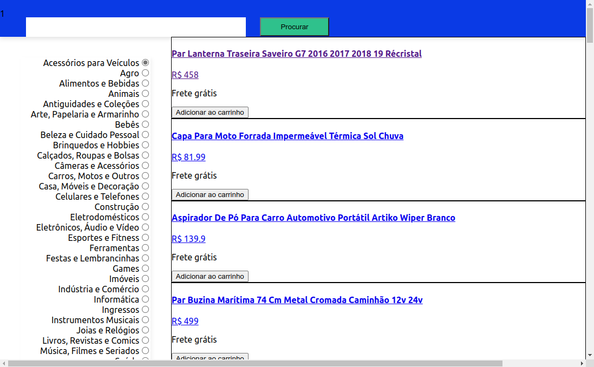

># Frontend Online Store

## Projeto completo! (Estilização em construção)

## Sobre o projeto
        Este projeto foi desenvolvido no módulo de front-end da Trybe onde eu e meu 
        grupo, constituído por: @ClaydsonHenrique @butzlaff @viniciusvieirac @MarcosVinicius-iwnl 
        conseguimos colocar em prática os aprendizados até então.
        O projeto é uma simulação de loja online onde consumimos dados da API real do Mercado
        Livre. Pegamos os dados, tratamos e usamos durante toda a aplicação, tendo carrinho
        de compras, detalhes de produto e muito mais.
         

># 🔗 [Acesse clicando aqui!](https://luandersonalvesdev.github.io/frontend-online-store/#/)

## 👨‍💻 APRENDIZADO
- Trabalhar em equipe usando Scrum.
- Entender e aplicar Métodos Ágeis.
- Entender e aplicar Kanban de maneira eficaz com Trello.
- Código assíncrono com React componentes de classe

## 🛠️ TECNOLOGIAS USADAS 
- React
- CSS
- JavaScript

## CONTATO

https://linkedin.com/in/luandersonalvesdev